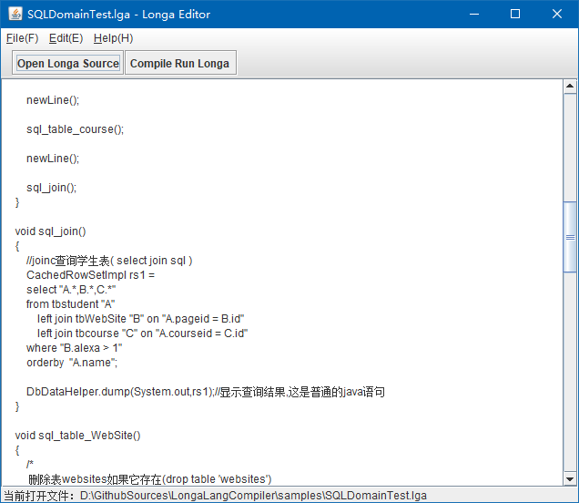

# LongaLangCompiler
Longa 是我发明的一种长链表达式调用技术，可以把接近mysql脚本的程序编译成Java字节码。  
Longa 程序展示


用root账号和密码连接mysql数据
```java
       connection "localhost" port 3306 use "testdb" user "root" password "123456" ;
```

查询mysql 学生表并显示结果
```java
        CachedRowSetImpl rs2 = select "*" from "student"; 
        DbDataHelper.dump(System.out,rs2);
```

删除mysql学生表如果它存在
```java
        drop table tbWebSite "student";
```

Longa项目是我在自己开发的简化版java语言的编译器上的基础上插入Longa编译技术,
可以把源码编译成字节码文件并成功运行。


## Longa优点
可以很好地模拟SQL语句  
可以作为通用DSL引擎  
可以模拟自然语言编程  

目前实现的SQL方面距离标准的SQL脚本已经非常解决，在当前的市面上找不到如此接近的。  
未来大家很可能在java程序直接编写运行SQL语句，不需要拼接字符串了；同时大家可以很方便的开发自己的DSL语言。

我正在推广这一个神奇的技术，希望大家这样支持我: 
1. 给项目加星
2. 向朋友同事宣传推荐
3. 我研究需要大量精力和一些物质支持,如果您觉得值，请打开收款码给我捐点款，1到20元都可以

## 运行环境
JDK 1.8  
IntelliJ IDEA

## 运行方法
打开IntelliJ IDEA，运行src/editor.TinyEditor类，  
点击工具栏按钮"Open Longa Source",选择samples下的 HelloWorld.lga，  
点击"Compile Run Longa"，IntelliJ IDEA的输出窗口会运行输出"Hello World...".  

## 例子说明
目录samples下有三个例子  
Longa暂时是为了研究演示,没有关键字static和public，编辑器会在编译成功后自动调用void main()方法  
HelloWorld.lga 最简单的HelloWorld,和java很接近  
GUIDSLTest.lga 演示Longa编写java swing图形
SQLDomainTest.lga 演示怎样用Longa连接mysql,删除创建查询表,修改正确的数据库连接信息可以实际运行



删除创建查询表
```java
void sql_table_WebSite()
{
         /*
          删除表websites如果它存在(drop table 'websites')
          也可以用 drop table tbWebSite,但是如果没有表websites会运行出错
          */
        drop table tbWebSite ifExists;

        /* 创建表websites (create table 'websites') */
        create table tbWebSite [
        column "name" dataType varchar 255 NotNULL comment "站点名称", //定义列,包括名称、数据类型、长度、备注
        ...
        ];

        /* 向表中插入测试数据 ( insert demo data into table 'websites' ) */
        insert into tbWebSite values ["1", "Google", "https://www.google.cm/", "1", "USA"] ;
        /* 运行select查询语句 ( ececute sql  SELECT ) 
         * 此处是执行语句 SELECT * FROM ...,结果是CachedRowSetImpl类型
         */
        CachedRowSetImpl rs2 = select "*" from tbWebSite; 
        DbDataHelper.dump(System.out,rs2); //显示查询结果
}
```
用swing创建登录窗口
```java
    void loginWindow()
    {
        Font font1 = new Font("Georgia", Font.PLAIN, 16);
        JFrame jframe = frame
                title "Login Window"
                size 350 200
                component (
                        panel noneLayout
                            component (label "User:" bounds 10 20 80 25 font font1)
                            component (textField bounds 100 20 165 25)
                            component (label "Password:" bounds 10 50 80 25)
                            component (textField bounds 100 50 165 25)
                            component (button "Login" bounds 90 90 80 25)
                )
        ;
    }
```
 
PhysicsPapers目录下是我写的一些物理学观点，与本项目完全无关，放在此是为了传播本人观点。  

<b>希望能得到您的支持</b>  

